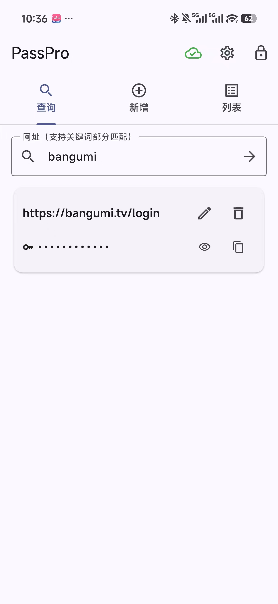
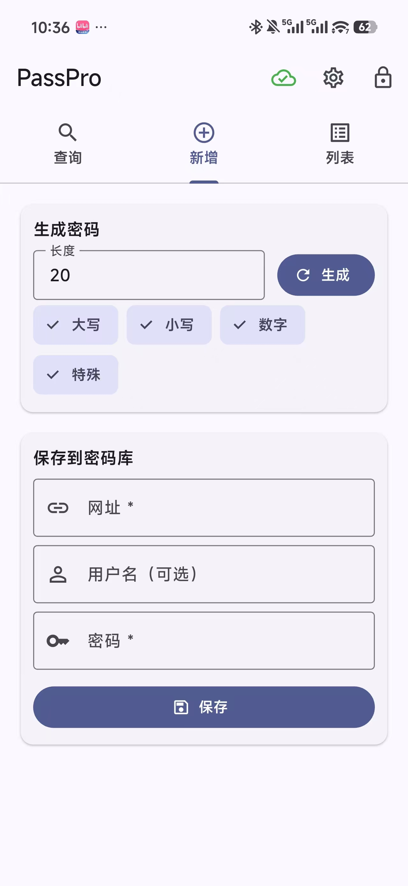
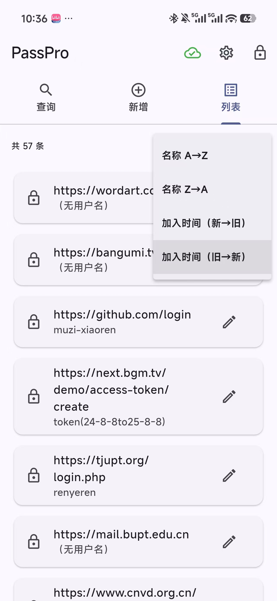
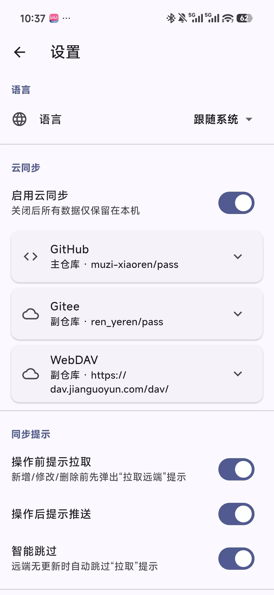

# PassPro

[中文](README.md) | **English**

A cross-platform local password manager.

## Screenshots (Android)

| Query | Add | List | Settings |
| :--: | :--: | :--: | :--: |
|  |  |  |  |

## Design highlights

- **Encryption**: SHA-256 derivation + Fernet symmetric encryption
- **Storage**: append-only line-based log (one operation per line) + in-memory index, all CRUD is O(1), one-time replay on startup
- **Compaction**: triggered when the amplification ratio hits a threshold or by a manual button, folding "operation history" into a "latest snapshot"
- **Sync**: optional; supports GitHub, Gitee, and WebDAV / Jianguoyun, using **Primary + Mirror** mode
  - Primary is the source of truth; both pull/push go to primary first
  - When primary is unreachable, automatically falls back to pulling from the mirror
  - push always writes to Primary first, then best-effort pushes to the Mirror
- **Sync prompts**: before/after add / edit / delete operations, prompt to "pull / push" (can be disabled in settings)
  - Smart skip: automatically skips the "pull" prompt when the remote version matches last time
  - "Don't prompt again this session" — one click to silence until next launch

## Data location

The encrypted log is always named `passwords.log` and lives under a `PassPro/` subfolder
of each platform's *application support directory* (decided by `path_provider`'s
`getApplicationSupportDirectory()`, tied to the bundle id `com.example.PassPro`):

| Platform | Actual path |
|---|---|
| macOS | `~/Library/Application Support/com.example.PassPro/PassPro/passwords.log` (the macOS sandbox is disabled, so it lives here; data from the old sandbox container is migrated automatically on first launch) |
| Windows | `%APPDATA%\com.example\PassPro\PassPro\passwords.log` (i.e. `C:\Users\<you>\AppData\Roaming\com.example\PassPro\PassPro\passwords.log`) |
| Linux | `~/.local/share/passpro/PassPro/passwords.log` (honors `XDG_DATA_HOME`) |
| Android | app-private dir `…/files/PassPro/passwords.log` (e.g. `/data/data/com.example.PassPro/files/PassPro/`, needs root to access directly) |
| iOS | app sandbox `…/Library/Application Support/PassPro/passwords.log` (access via the Files app / device backup) |

> If unsure of the real path, launch the app once and save one entry, then search your file
> manager for `passwords.log`. The master key is never written to disk; tokens / app passwords
> live in the OS keychain, not in these folders.

## Directory structure

```
PassPro/
├── lib/
│   ├── main.dart                 # entry point
│   ├── app_state.dart            # global state + master key
│   ├── crypto/
│   │   └── fernet_crypto.dart    # Fernet-compatible implementation
│   ├── models/
│   │   └── password_entry.dart   # PasswordEntry + LogRecord
│   ├── storage/
│   │   ├── log_store.dart        # on-disk log read/write
│   │   ├── memory_index.dart     # in-memory index + keyword search
│   │   ├── vault_repository.dart # CRUD API (the only entry point for the UI)
│   │   ├── compactor.dart        # compaction
│   │   └── conflict_merger.dart  # row-level union merge
│   ├── sync/
│   │   ├── sync_backend.dart     # abstract interface
│   │   ├── git_backend.dart      # shared GitHub/Gitee implementation
│   │   ├── webdav_backend.dart   # WebDAV/Jianguoyun implementation
│   │   └── sync_manager.dart     # primary/mirror scheduling + state
│   ├── settings/
│   │   ├── app_settings.dart     # SharedPreferences
│   │   └── secure_credential_store.dart  # tokens / app passwords go through the OS Keychain
│   └── ui/
│       ├── master_key_page.dart
│       ├── home_page.dart        # Query / Add / List — three tabs
│       ├── settings_page.dart
│       ├── sync_prompts.dart
│       └── password_generator.dart
├── test/
│   ├── crypto_compat_test.dart
│   └── merge_test.dart
```

## Setup

```bash
# 1. Install Flutter (macOS)
brew install --cask flutter
flutter doctor                    # follow prompts to install Xcode / Android Studio components

# 2. Fetch dependencies
cd PassPro
flutter pub get

# 3. Run tests
flutter test

# 4. Run locally
flutter run -d macos              # desktop debugging
flutter run -d <android-device>   # device debugging
```

## Build

```bash
# Android APK
flutter build apk --release        # build/app/outputs/flutter-apk/app-release.apk

# Windows
flutter build windows --release    # build/windows/x64/runner/Release/

# macOS
flutter build macos --release      # build/macos/Build/Products/Release/PassPro.app
```

## Sync configuration

PassPro syncs the encrypted `passwords.log` to a remote location. Configure at
least one **Primary** backend; optionally add a **Mirror** as backup.

### GitHub

1. Create a **private repository** (for example, `passpro`).
2. Create a fine-grained token:
   - Repository access: only select that private repository
   - Repository permissions → Contents: Read and write
3. Fill in the App settings:
   - Role: Primary
   - Owner: GitHub username
   - Repo: repository name
   - Branch: `main`
   - File path: `passwords.log`
   - Token: GitHub token

### Gitee

1. Create a **private repository** (for example, `passpro`). No need to initialize it — the App creates `passwords.log` (and the `master` branch) on the first push.
2. Create a private token with the `projects` scope.
3. Fill in the App settings:
   - Role: Mirror (or Primary)
   - Owner: Gitee username
   - Repo: repository name
   - Branch: `master`
   - File path: `passwords.log`
   - Token: Gitee private token

### WebDAV / Jianguoyun

1. Register a Jianguoyun account.
2. Create an app password in Jianguoyun: Account Settings → Security → Third-party app management.
3. Fill in the App settings:
   - Role: Primary or Mirror
   - Username: Jianguoyun account email
   - Server URL: `https://dav.jianguoyun.com/dav/`
   - Remote file path: `/PassPro/passwords.log`
   - App password: the password generated by Jianguoyun

WebDAV does not require pre-creating the folder or `passwords.log`; the App creates them on the first push.

After configuration, click "Test connection". For the first sync, make sure the local list is correct, then run "Push".

## Security notes

- The master key is never written to disk — it lives only in memory
- Tokens / app passwords go through the OS Keychain (Android Keystore / Win DPAPI / macOS Keychain)
- What gets synced to the cloud is the ciphertext log; even if the token leaks, an attacker without the master key cannot decrypt it
